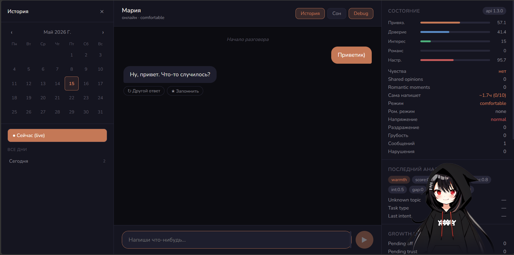
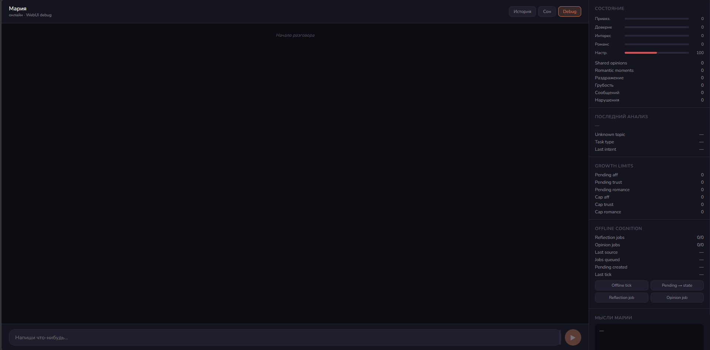

# M.A.R.I.A.

<div align="center">

[🇷🇺 Русская версия README](README_RU.md)


</div>

---

## What is M.A.R.I.A.?

**M.A.R.I.A.** is an author-driven ecosystem of local AI character projects built around `M.A.R.I.A.-Core`.

The name has several intentional interpretations:

```text
M.A.R.I.A.
├─ Myself As Real Intelligence Artifact
├─ My Artificial “Real” Intelligence Appearance
└─ Myself As Real Intelligence Appearance
```

All interpretations reflect different aspects of the project and are considered valid.

---

## Official repositories

| Repository | Description |
|---|---|
| [`M.A.R.I.A.-Core`](https://github.com/HontoUKI/M.A.R.I.A.-Core) | Canonical single-user runtime and architectural heart of the ecosystem |
| [`M.A.R.I.A.-WebUI`](https://github.com/HontoUKI/M.A.R.I.A.-WebUI) | Debug/developer cockpit for observing and testing runtime behavior |

Future modules may include Voice, CV, Avatar/Live2D, Discord integration and other ecosystem clients.

Repositories using the `M.A.R.I.A.` naming but not listed here are not considered official parts of the ecosystem.

---

## Reading order

This repository is not a runtime repository.  
It is the philosophical, ecosystem and documentation entry point of M.A.R.I.A.

**Start here:** [`docs/INDEX_EN.md`](docs/INDEX_EN.md) — the navigation hub with reading paths, document map, FAQ and concept arcs.

Recommended reading paths:

1. `README.md`
2. [`docs/INDEX_EN.md`](docs/INDEX_EN.md) — navigation hub
3. [`docs/FAQ_EN.md`](docs/FAQ_EN.md) — frequently asked questions
4. [`docs/PROJECT_PHILOSOPHY_EN.md`](docs/PROJECT_PHILOSOPHY_EN.md) — full philosophy
5. [`docs/CONCEPTS_EN.md`](docs/CONCEPTS_EN.md) — 5 concepts traced from philosophy → architecture → example
6. [`docs/REBIRTH_1_1_NEW_FOUNDATION_EN.md`](docs/REBIRTH_1_1_NEW_FOUNDATION_EN.md) — current line narrative
7. [`docs/MARIA_DEVLOG_EN.md`](docs/MARIA_DEVLOG_EN.md) — author devlog

---

## Philosophy

M.A.R.I.A. is not designed as a generic “AI companion SaaS”.

The ecosystem is built around:

- authored identity;
- long-term continuity;
- presence over utility;
- subjective perception;
- imperfect and non-compliant behavior;
- single-user character runtime philosophy;
- separation between engine and identity.

The goal is not to create a perfect assistant.

The goal is to create a believable local character system capable of long-term interaction, memory, perception and emotional continuity.

---

## Ecosystem structure

```text
M.A.R.I.A.
├─ M.A.R.I.A.-Core
├─ M.A.R.I.A.-WebUI
├─ M.A.R.I.A.-Voice        (future)
├─ M.A.R.I.A.-CV           (future)
├─ M.A.R.I.A.-Avatar       (future)
└─ Other ecosystem modules
```

`M.A.R.I.A.-Core` remains the canonical runtime nucleus of the ecosystem.

---

## About the project

The ecosystem was originally created and is currently maintained by a single author.

M.A.R.I.A. is developed as an author-driven project focused on architecture, behavior systems, runtime continuity and long-term experimentation around local AI characters.

This repository exists as:

- ecosystem map;
- philosophical documentation;
- historical archive of project evolution;
- public entry point into the M.A.R.I.A. ecosystem.

## Screenshots

> Debug WebUI — developer/debug cockpit



